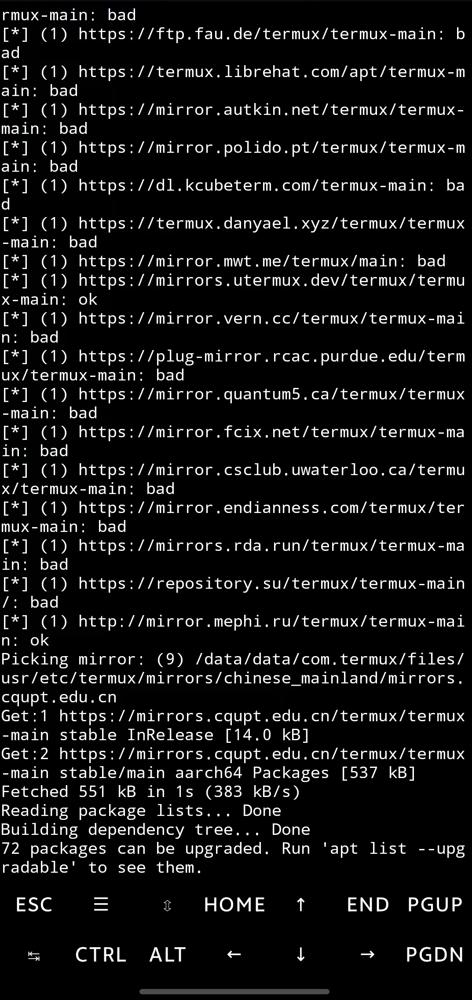
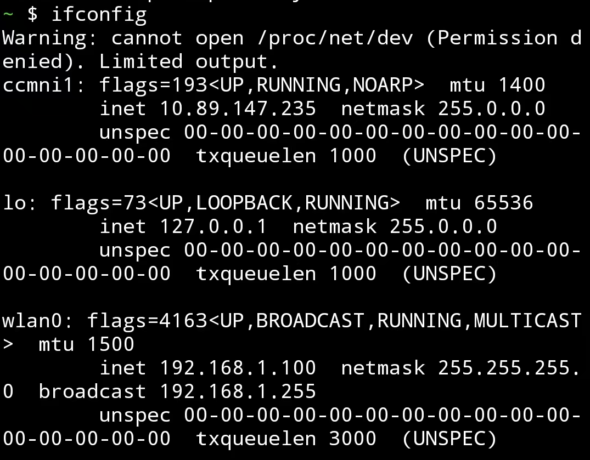
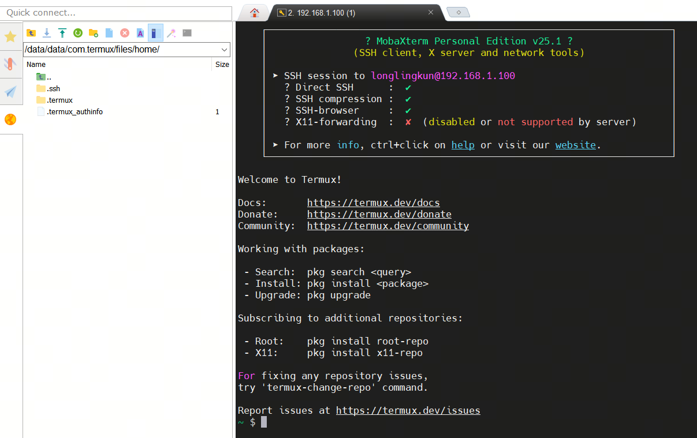
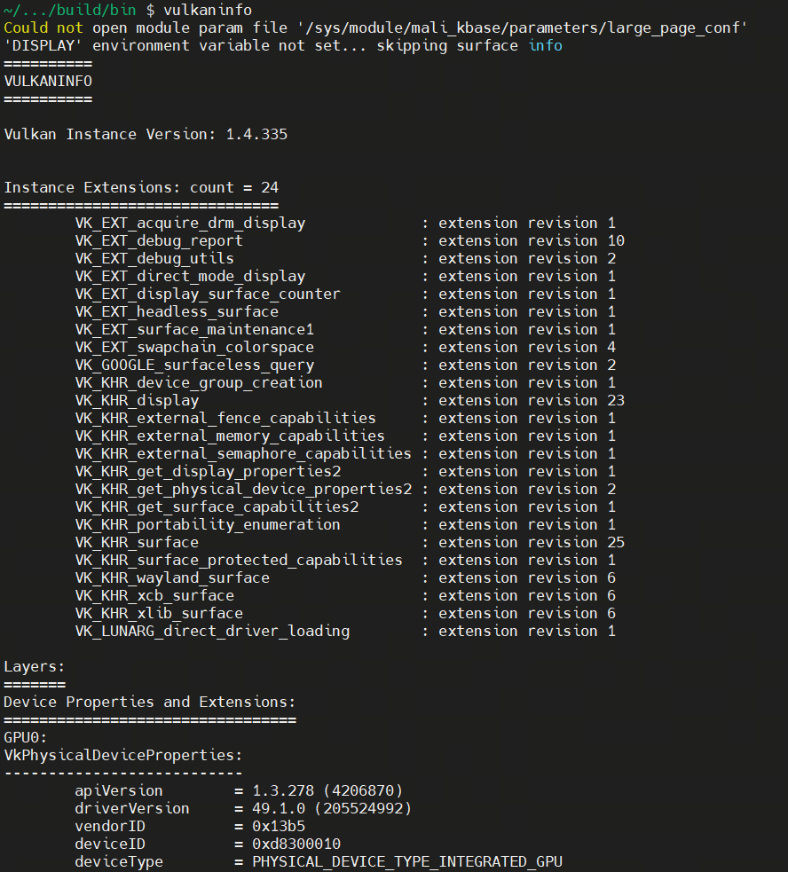
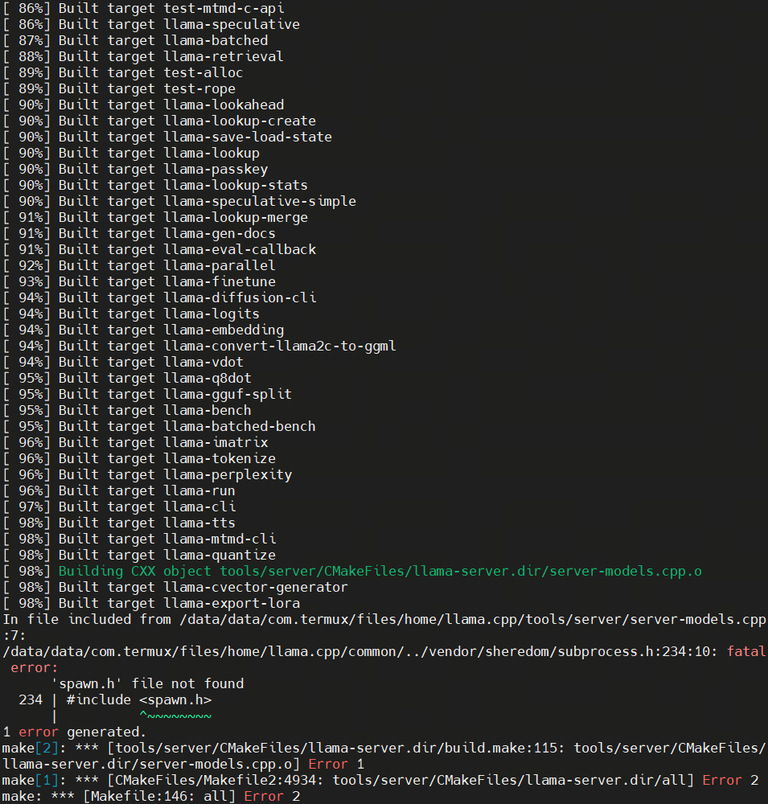
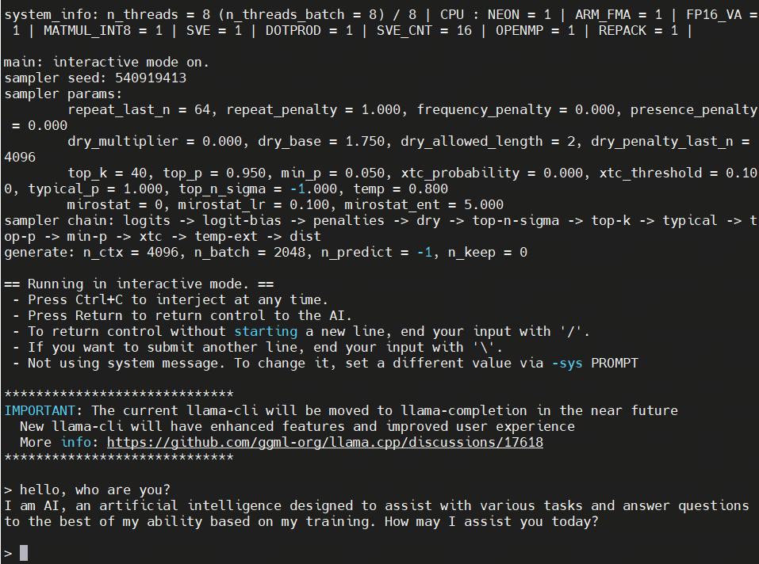

# 如何在安卓设备上运行llama.cpp

## 1. 开发环境配置

Termux下载官网：[termux](https://termux.dev/cn/index.html)

国内用户在下载完成后可以使用如下命令修改源：

```bash
termux-change-repo
```

更多信息请参考：[Termux镜像使用帮助](https://mirrors.tuna.tsinghua.edu.cn/help/termux/)



1. 安装ssh，提示全部按回车键默认即可。

```sh
apt install openssh
```

2. 设置密码，输入以下命令，然后输入密码(例如123456)，第二次确认密码。

```
passwd
```

3. 开启sshd服务：输入以下命令

```
sshd
```

4. 查看IP地址：输入以下命令

```
ifconfig
```



5. SSH连接：要求手机电脑在同一局域网内, 输入密码即可ssh连接

```
ssh 192.168.1.100 -p 8022
```

(本教程使用MobaXterm作为演示示例)



### 2. 安装必要的软件包

更新包管理器并安装所需的依赖：

```bash
pkg update && pkg install tur-repo x11-repo vulkan-tools shaderc
```

这些软件包包括 Vulkan 工具链和其他必要的库。

---

### 3. 安装 Vulkan 驱动

为了使用 GPU 加速，我们需要安装 Vulkan 驱动。可以从以下链接下载驱动：[下载 Vulkan 驱动](https://github.com/Jie-Qiao/Android-Termux-LLM-Tutorial/raw/refs/heads/main/mesa-vulkan-icd-wrapper-dbg_24.2.5-5_aarch64.deb)

下载完成后，找到驱动文件并使用以下命令安装：

```bash
dpkg -i ./mesa-vulkan-icd-wrapper-dbg_24.2.5-7_aarch64.deb
```

安装完成后，验证 Vulkan 是否正常工作：

```bash
pkg install vkmark
vulkaninfo
```

如果一切正常，`vulkaninfo` 将显示 GPU 的相关信息。



---

### 4. 编译 `llama.cpp`

接下来，我们将编译 `llama.cpp` 项目。首先，安装必要的编译工具：

```bash
pkg install git cmake
```

然后，克隆 `llama.cpp` 和 Vulkan 头文件的仓库：

```bash
git clone https://github.com/KhronosGroup/Vulkan-Headers.git
git clone https://github.com/ggerganov/llama.cpp.git
```

如果有网络问题，可以直接访问https://github.com/KhronosGroup/Vulkan-Headers.git和https://github.com/ggerganov/llama.cpp.git，下载代码包（Zip格式），通过SSH上传至手机。

进入 `llama.cpp` 目录并开始编译：

```bash
cd ~/llama.cpp
cmake -B build -DGGML_VULKAN=ON -DVulkan_LIBRARY=/system/lib64/libvulkan.so -DVulkan_INCLUDE_DIR=~/Vulkan-Headers/include
cmake --build build --config Release -j32
```



(spawn.h相关的报错可暂时忽略，本地运行可以不支持server服务)

### 5. 下载并运行模型

你可以从 Hugging Face 下载 GGUF 格式的模型。例如：

[Qwen/Qwen2-1.5B-Instruct-GGUF at main](https://huggingface.co/Qwen/Qwen2-1.5B-Instruct-GGUF/tree/main)

下载模型文件（如 [qwen2-1_5b-instruct-fp16.gguf](https://huggingface.co/bartowski/DeepSeek-R1-Distill-Qwen-1.5B-GGUF/blob/main/DeepSeek-R1-Distill-Qwen-1.5B-Q4_K_M.gguf)）并将其放入 `llama.cpp`目录中。

找到编译后bin文件中的llama-cli，运行模型：

```bash
cd build/bin
./llama-cli -m /path/to/qwen2-1_5b-instruct-fp16.gguf
```



### 6. 参考资料

[llama.cpp/docs/build.md at master · ggerganov/llama.cpp](https://github.com/ggerganov/llama.cpp/blob/master/docs/build.md)

[Qualcomm drivers it's here! : r/termux](https://www.reddit.com/r/termux/comments/1gmnf7s/qualcomm_drivers_its_here/)